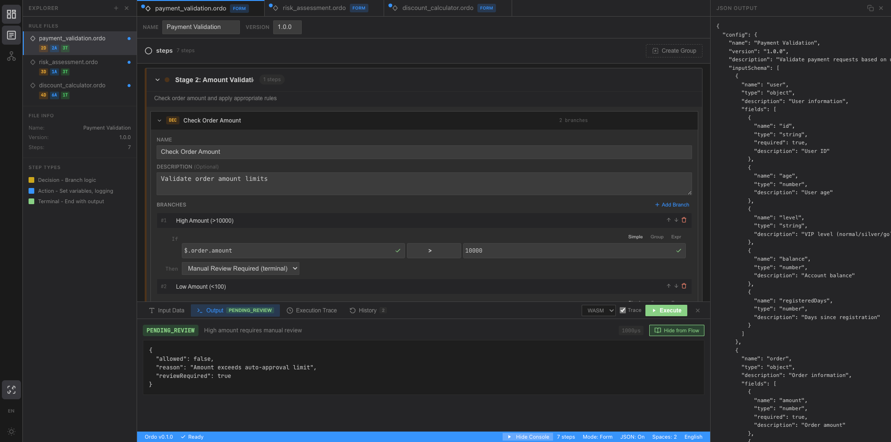
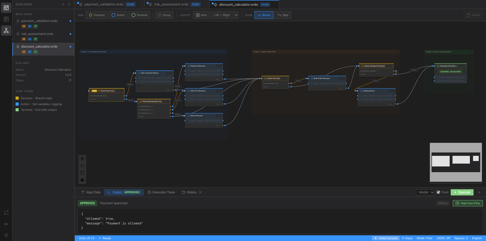

<p align="center">
  
</p>

<h1 align="center">Ordo</h1>

<p align="center">
  <strong>Sub-microsecond rule execution with a built-in visual editor</strong>
</p>

<p align="center">
  <a href="#features">Features</a> •
  <a href="#visual-editor">Visual Editor</a> •
  <a href="#performance">Performance</a> •
  <a href="#quick-start">Quick Start</a> •
  <a href="#license">License</a>
</p>

<p align="center">
  
  
  <a href="https://pama-lee.github.io/Ordo/"></a>
  <a href="https://www.npmjs.com/package/@ordo-engine/editor-core"></a>
  <a href="https://discord.gg/Y529FkArhh"></a>
</p>


---

## What is Ordo?

**Ordo** (Latin for "order") is an enterprise-grade rule engine built in Rust — evaluate business rules with **sub-microsecond latency** without touching your application code.

**Try it now:** [Live Playground](https://pama-lee.github.io/Ordo/)

**Best for:**
- Fraud / risk scoring where latency matters
- Promotion and discount logic that non-engineers need to update
- Payment routing and access-control decisions under high load
- Any business rule that today lives as hard-coded `if/else`

**Why teams use Ordo:**
- Replace brittle if/else chains with a visual flow editor their ops team can actually read
- Push rule logic down into the database — no full-table scans, no row-by-row evaluation
- Run the same rules in the browser (WASM), over HTTP, or via gRPC with identical semantics

---

## How it works

Define a rule (JSON or YAML):

```json
{
  "config": { "name": "discount", "entry_step": "check" },
  "steps": {
    "check": {
      "type": "decision",
      "branches": [{ "condition": "user.vip == true", "next_step": "vip" }],
      "default_next": "normal"
    },
    "vip":    { "type": "terminal", "result": { "code": "VIP",    "message": "20% off" } },
    "normal": { "type": "terminal", "result": { "code": "NORMAL", "message": "5% off"  } }
  }
}
```

Evaluate in ~1.6 µs:

```json
// Input
{ "user": { "vip": true } }

// Output
{ "code": "VIP", "message": "20% off" }
```

Rules live outside your code — update them without redeploying.

---

## Why Ordo?

| | **Ordo** | OPA | Drools | json-rules-engine |
|---|---|---|---|---|
| Single-rule latency | **~1.6 µs** | ~1 ms | ~5–10 ms | ~0.5 ms |
| JIT compilation | ✅ Cranelift | ❌ | ❌ | ❌ |
| Visual editor | ✅ built-in | ❌ | ✅ (Workbench, heavy) | ❌ |
| DB filter push-down | ✅ SQL/JSON/Mongo | ❌ | ❌ | ❌ |
| WASM / browser | ✅ native | ⚠️ via `opa build -t wasm` | ❌ | ✅ (Node only) |
| Deployment | single binary | single binary (daemon) | JVM | Node.js service |
| Language | Rust | Rego (DSL) | Java | JavaScript |

<sub>Latency figures are warm-run single-thread benchmarks on Apple Silicon (M-series). OPA and Drools numbers are from their own published benchmarks and community reports; json-rules-engine measured locally. See <a href="benchmark/">benchmark/</a> for scripts, raw data, and methodology.</sub>

---

## Features

### Visual Rule Editor

Design complex business rules with an intuitive drag-and-drop flow editor:

<p align="center">
  
</p>
<p align="center">
  
</p>

- **Flow View**: Visualize rule logic as connected decision trees
- **Form View**: Edit conditions and actions with a structured form interface
- **Real-time Execution**: Test rules instantly with WASM-powered execution
- **Execution Trace**: Debug step-by-step with visual path highlighting

### Performance

- **1.63 µs** average rule execution (interpreter, warm, Apple Silicon M-series)
- **50–80 ns** with JIT compilation — 20–30x faster for numeric expressions
- **54,000 QPS** on HTTP API, single thread
- Zero-allocation hot path; pre-compiled expression evaluation

> Benchmark methodology: Apple Silicon M-series, single-threaded, warm runs, L1–L4 rule complexity.
> See [benchmark/](benchmark/) for scripts, raw data, and comparison methodology.

### Flexible Rule Definition

- **Step Flow Model**: Linear decision steps with conditional jumps
- **Rich Expressions**: Comparisons, logical operators, functions, conditionals
- **Built-in Functions**: `len()`, `sum()`, `avg()`, `upper()`, `lower()`, `abs()`, `min()`, `max()`
- **Field Coalescing**: `coalesce(field, fallback, default)` for missing field handling

### Data Filter API

Push rule logic directly into your database — no full-table scans, no row-by-row evaluation:

```bash
# "What documents can user alice see?" → SQL WHERE clause ready to use
curl -X POST http://localhost:8080/api/v1/rulesets/doc_access/filter \
  -d '{
    "known_input": { "user": { "role": "member", "id": "alice", "subscription": "free" } },
    "target_results": ["ALLOW"],
    "format": "sql",
    "field_mapping": { "doc.owner_id": "owner_id", "doc.visibility": "visibility" }
  }'

# → "filter": "(owner_id = 'alice') OR (visibility = 'public')"
```

- **Partial Evaluation**: Known fields fold to constants; unknown fields become DB columns
- **Admin shortcut**: Returns `always_matches: true` → skip the WHERE clause entirely
- **Zero rows shortcut**: Returns `never_matches: true` → return empty result immediately
- **SQL, JSON, and MongoDB `$match` output**: Standard WHERE clause, predicate tree, or `$match` stage
- **Zero impact on execution**: Completely separate code path, no hot-path overhead

### Compiled Rules (Rule Protection)

Protect your business logic by compiling rules into binary format:

```rust
// Compile ruleset to binary .ordo format (CRC32 integrity + optional ED25519 signature)
let compiled = RuleSetCompiler::compile(&ruleset)?;
compiled.save_to_file("rules.ordo")?;

// Load and execute
let loaded = CompiledRuleSet::load_from_file("rules.ordo")?;
let result = CompiledRuleExecutor::new().execute(&loaded, input)?;
```

### Production Ready

- **Deterministic execution**: Same input → same path → same result, always
- **Hot reload**: Update rules without service restart
- **Version history + rollback**: Keep N versions, roll back with one API call
- **Audit logging**: JSON Lines log of rule changes and executions (configurable sampling)
- **Prometheus metrics** + health endpoint out of the box
- **Distributed deployment**: Single-writer / multi-reader with NATS JetStream sync

### Integration

- **HTTP REST API**: Simple JSON-based interface
- **WebAssembly**: Run rules directly in the browser
- **gRPC**: High-performance binary protocol
- **npm packages**: `@ordo-engine/editor-core`, `@ordo-engine/editor-vue`, `@ordo-engine/editor-react`

---

## Performance

<p align="center">
  
</p>

All numbers measured on Apple Silicon (M-series), single thread, warm runs:

| Metric | Result |
|--------|--------|
| Single rule execution (interpreter) | **1.63 µs** |
| Single rule execution (JIT) | **50–80 ns** |
| Expression evaluation | **79–211 ns** |
| HTTP API throughput (single thread) | **54,000 QPS** |

### JIT Compilation

Schema-aware JIT powered by Cranelift — **20–30x speedup** for numeric expressions:

```rust
#[derive(TypedContext)]
struct UserContext {
    age: i64,
    balance: f64,
    vip_level: i64,
}

// Runs at native speed after first compile
let result = jit_evaluator.evaluate("age >= 18 && balance > 1000.0", &context);
```

See [benchmark/](benchmark/) for detailed reports, graphs, and comparison methodology.

---

## Quick Start

### Try in 30 seconds

**Docker** (no Rust install needed):

```bash
docker run -d -p 8080:8080 ghcr.io/pama-lee/ordo:latest
```

<details>
<summary>From source</summary>

```bash
git clone https://github.com/Pama-Lee/Ordo.git
cd Ordo
cargo build --release
./target/release/ordo-server
```

</details>

Create a rule:

```bash
curl -X POST http://localhost:8080/api/v1/rulesets \
  -H "Content-Type: application/json" \
  -d '{
    "config": { "name": "discount-check", "version": "1.0.0", "entry_step": "check_vip" },
    "steps": {
      "check_vip": {
        "id": "check_vip", "name": "Check VIP Status", "type": "decision",
        "branches": [{ "condition": "user.vip == true", "next_step": "vip_discount" }],
        "default_next": "normal_discount"
      },
      "vip_discount":   { "id": "vip_discount",   "name": "VIP Discount",    "type": "terminal", "result": { "code": "VIP",    "message": "20% discount" } },
      "normal_discount":{ "id": "normal_discount", "name": "Normal Discount", "type": "terminal", "result": { "code": "NORMAL", "message": "5% discount"  } }
    }
  }'
```

Execute it:

```bash
curl -X POST http://localhost:8080/api/v1/rulesets/discount-check/execute \
  -H "Content-Type: application/json" \
  -d '{ "input": { "user": { "vip": true } } }'
# → { "code": "VIP", "message": "20% discount" }
```

Or try the **[Live Playground](https://pama-lee.github.io/Ordo/)** — no install needed.

### Use the Visual Editor

```bash
cd ordo-editor && pnpm install && pnpm dev
```

### Expression Syntax

```
age >= 18 && status == "active"
tier == "gold" || tier == "platinum"
user.profile.level
len(items) > 0 && sum(prices) >= 100
if exists(discount) then price * (1 - discount) else price
```

### npm Packages

```bash
npm install @ordo-engine/editor-vue    # Vue 3
npm install @ordo-engine/editor-react  # React
npm install @ordo-engine/editor-core   # Framework-agnostic
```

<details>
<summary><strong>Production Setup</strong> — persistence, versioning, audit, monitoring</summary>

### Persistence

```bash
./target/release/ordo-server --rules-dir ./rules
# Rules auto-loaded on startup (.json / .yaml / .yml)
# Saved/deleted via API automatically
```

### Version Management

```bash
./target/release/ordo-server --rules-dir ./rules --max-versions 10

# List versions
curl http://localhost:8080/api/v1/rulesets/discount-check/versions

# Rollback
curl -X POST http://localhost:8080/api/v1/rulesets/discount-check/rollback \
  -d '{"seq": 2}'
```

### Audit Logging

```bash
# Enable with 10% execution sampling
./target/release/ordo-server --rules-dir ./rules --audit-dir ./audit --audit-sample-rate 10
```

Logs JSON Lines: `rule_created`, `rule_updated`, `rule_executed`, `rule_rollback`, etc.
Sample rate is adjustable at runtime via `PUT /api/v1/config/audit-sample-rate`.

### Monitoring

```bash
curl http://localhost:8080/health    # Health check
curl http://localhost:8080/metrics   # Prometheus metrics
```

</details>

---

## Project Structure

```
ordo/
├── crates/
│   ├── ordo-core/       # Core rule engine library
│   ├── ordo-derive/     # Derive macros for TypedContext
│   ├── ordo-server/     # HTTP/gRPC API server
│   ├── ordo-wasm/       # WebAssembly bindings
│   └── ordo-proto/      # Protocol definitions
├── ordo-editor/         # Visual rule editor (pnpm workspace)
│   ├── packages/        # core / vue / react / wasm
│   └── apps/            # playground / docs (VitePress)
├── scripts/             # Build & release scripts
└── benchmark/           # Performance reports
```

---

## Roadmap

- [x] Core rule engine
- [x] HTTP REST API + gRPC
- [x] Execution tracing
- [x] Built-in functions
- [x] Visual rule editor
- [x] WebAssembly support
- [x] Rule versioning & history
- [x] Audit logging
- [x] JIT compilation (Cranelift)
- [x] Schema-aware typed contexts
- [x] npm packages (Vue, React, Core)
- [x] Compiled ruleset (binary .ordo format)
- [x] Enterprise plugin system
- [x] .ordo file import/export in Playground
- [x] Distributed deployment (NATS JetStream sync)
- [x] Data Filter API (SQL / JSON / MongoDB `$match` push-down)
- [ ] Collaborative editing
- [ ] Rule marketplace

---

## License

MIT License — see [LICENSE](LICENSE) for details.

---

<p align="center">
  <sub>Built with Rust</sub>
</p>
