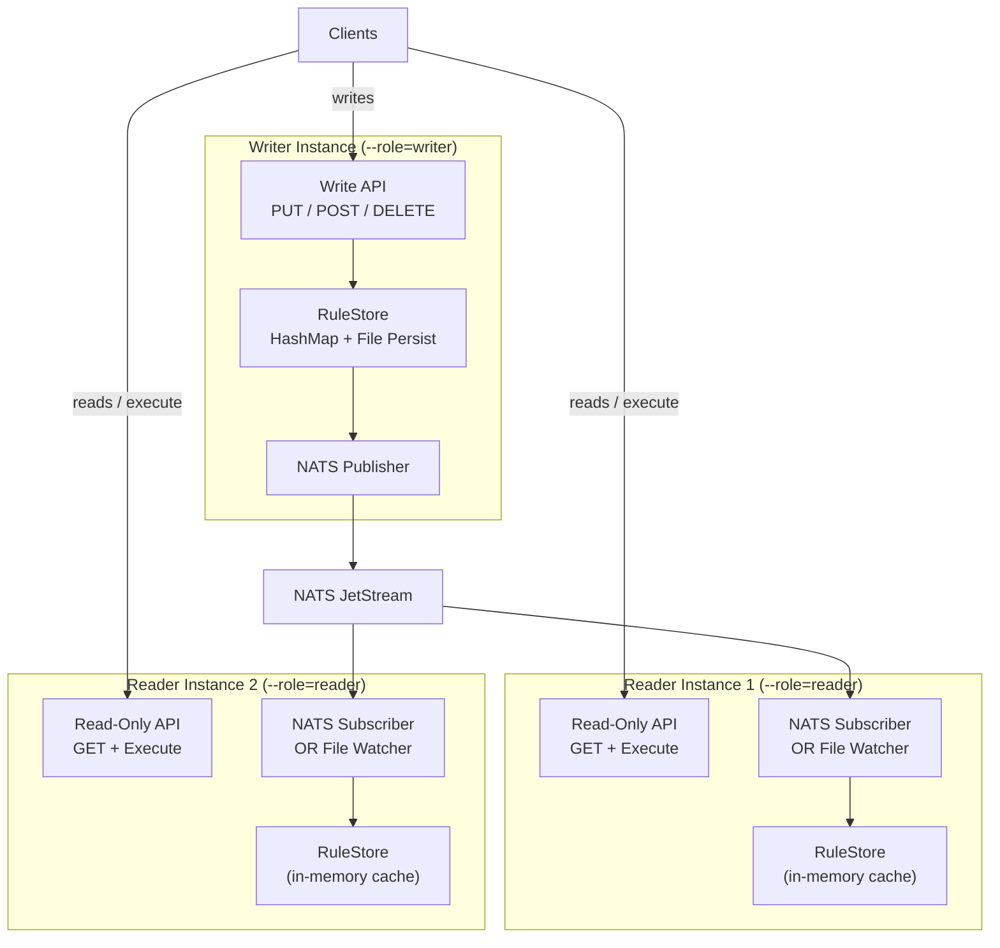
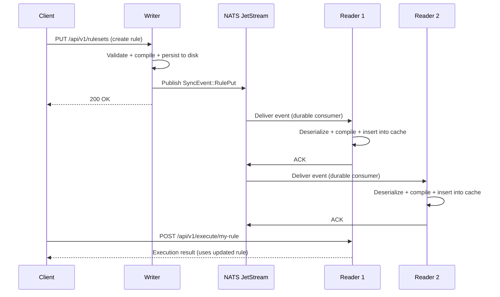
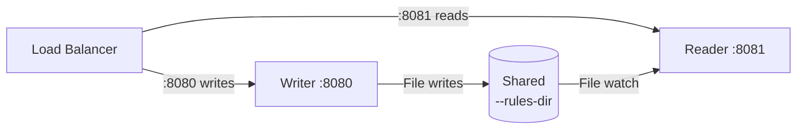
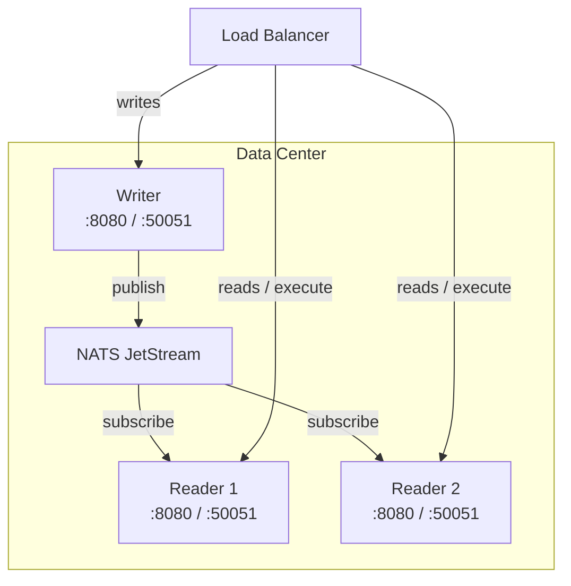

# Distributed Deployment

Ordo supports a **single-writer, multi-reader** distributed deployment model. One writer instance handles all rule mutations, while multiple reader instances serve read and execute requests. Rule changes propagate automatically via file watching (same machine) or NATS JetStream (across machines).

## Architecture Overview



## Design Principles

| Principle                       | Description                                                                                                 |
| ------------------------------- | ----------------------------------------------------------------------------------------------------------- |
| **Single-writer, multi-reader** | One writer instance handles mutations; readers reject writes with `409 Conflict` and redirect to the writer |
| **Zero execution-path impact**  | Sync only affects the admin plane (rule CRUD). The `Arc<RuleSet>` execution path is unchanged               |
| **Graceful degradation**        | If the sync channel disconnects, all instances continue serving with their local cache                      |
| **Backward compatible**         | Without sync flags, behavior is identical to a standalone instance                                          |

## Instance Roles

Ordo supports three roles via `--role`:

### Standalone (default)

The current single-node behavior. Full read/write access, no sync.

```bash
ordo-server --rules-dir ./rules
```

### Writer

Accepts all mutations (PUT/POST/DELETE) and publishes changes to readers.

```bash
ordo-server --role writer --rules-dir ./rules --nats-url nats://localhost:4222
```

### Reader

**Read-only** — serves GET and execute requests. Rejects all write operations with:

- **HTTP**: `409 Conflict` with `{"error": "read_only", "writer": "http://..."}`
- **gRPC**: `FAILED_PRECONDITION` status

```bash
ordo-server --role reader --nats-url nats://localhost:4222 --writer-addr http://writer:8080
```

## Sync Mechanisms

Ordo offers two sync mechanisms that can be used independently or together:

### 1. File Watcher (Phase 1 — Same Machine)

For deployments where writer and readers share a filesystem (same machine or NFS mount):

```bash
# Writer
ordo-server --role writer --rules-dir /shared/rules --watch-rules

# Reader (same machine or NFS mount)
ordo-server --role reader --rules-dir /shared/rules --watch-rules \
  --writer-addr http://localhost:8080
```

**How it works:**

1. Writer persists rule changes to `--rules-dir`
2. Reader's file watcher detects changes (200ms debounce)
3. Reader hot-reloads the modified rule into memory
4. Self-write suppression prevents the writer from reloading its own writes

**Fallback:** If the native file watcher fails, a 30-second polling loop automatically activates.

### 2. NATS JetStream (Phase 2 — Across Machines)

For multi-machine deployments using [NATS](https://nats.io) as the event transport:

```bash
# Writer (machine 1)
ordo-server --role writer --rules-dir /data/rules \
  --nats-url nats://nats:4222

# Reader (machine 2)
ordo-server --role reader \
  --nats-url nats://nats:4222 \
  --writer-addr http://writer:8080

# Reader (machine 3) — can also have local rules-dir as cache
ordo-server --role reader --rules-dir /data/rules \
  --nats-url nats://nats:4222 --watch-rules \
  --writer-addr http://writer:8080
```

**How it works:**

1. Writer publishes `SyncEvent` to NATS JetStream after each mutation
2. Each reader has a **durable pull consumer** — events are replayed from the last acknowledged position on restart
3. Echo suppression: each instance has a unique `--instance-id`; messages from self are skipped
4. Idempotent dedup: the reader compares the event version against the local ruleset version



::: tip Combining Both Mechanisms
You can enable both file watching and NATS sync for redundancy. NATS provides fast, real-time propagation, while the file watcher serves as a fallback for eventually-consistent sync.
:::

## Configuration Reference

### Role & Sync

| Flag            | Env Var            | Default      | Description                                        |
| --------------- | ------------------ | ------------ | -------------------------------------------------- |
| `--role`        | `ORDO_ROLE`        | `standalone` | Instance role: `standalone`, `writer`, or `reader` |
| `--writer-addr` | `ORDO_WRITER_ADDR` | —            | Writer address included in reader 409 responses    |
| `--watch-rules` | `ORDO_WATCH_RULES` | `false`      | Enable file-system watching for live rule reload   |

### NATS Sync

| Flag                    | Env Var                    | Default      | Description                                                 |
| ----------------------- | -------------------------- | ------------ | ----------------------------------------------------------- |
| `--nats-url`            | `ORDO_NATS_URL`            | —            | NATS server URL (e.g. `nats://localhost:4222`)              |
| `--nats-subject-prefix` | `ORDO_NATS_SUBJECT_PREFIX` | `ordo.rules` | Subject prefix for sync events                              |
| `--instance-id`         | `ORDO_INSTANCE_ID`         | random       | Unique instance ID for consumer naming and echo suppression |

::: warning Feature Flag Required
NATS sync requires the `nats-sync` feature flag at build time:

```bash
cargo build --release --features nats-sync
```

Without this flag, `--nats-url` is accepted but has no effect.
:::

## Deployment Topologies

### Topology 1: Same Machine, Multiple Ports

Simplest setup. Uses file watching for sync.

```bash
# Writer on port 8080
ordo-server --role writer -p 8080 --rules-dir ./rules --watch-rules

# Reader on port 8081
ordo-server --role reader -p 8081 --grpc-port 50052 \
  --rules-dir ./rules --watch-rules \
  --writer-addr http://localhost:8080
```



### Topology 2: Multi-Machine with NATS

Production-grade setup. Requires a NATS server (or cluster).

```bash
# Machine 1: Writer
ordo-server --role writer --rules-dir /data/rules \
  --nats-url nats://nats:4222 --instance-id writer-1

# Machine 2: Reader
ordo-server --role reader \
  --nats-url nats://nats:4222 --instance-id reader-1 \
  --writer-addr http://writer:8080

# Machine 3: Reader
ordo-server --role reader \
  --nats-url nats://nats:4222 --instance-id reader-2 \
  --writer-addr http://writer:8080
```



### Topology 3: Kubernetes

Use environment variables and a NATS Helm chart:

```yaml
# Writer Deployment
apiVersion: apps/v1
kind: Deployment
metadata:
  name: ordo-writer
spec:
  replicas: 1 # Must be exactly 1
  template:
    spec:
      containers:
        - name: ordo
          image: ordo-server:latest
          args: ['--features', 'nats-sync']
          env:
            - name: ORDO_ROLE
              value: 'writer'
            - name: ORDO_RULES_DIR
              value: '/data/rules'
            - name: ORDO_NATS_URL
              value: 'nats://nats:4222'
            - name: ORDO_INSTANCE_ID
              valueFrom:
                fieldRef:
                  fieldPath: metadata.name
          volumeMounts:
            - name: rules
              mountPath: /data/rules
      volumes:
        - name: rules
          persistentVolumeClaim:
            claimName: ordo-rules-pvc
---
# Reader Deployment
apiVersion: apps/v1
kind: Deployment
metadata:
  name: ordo-reader
spec:
  replicas: 3 # Scale as needed
  template:
    spec:
      containers:
        - name: ordo
          image: ordo-server:latest
          env:
            - name: ORDO_ROLE
              value: 'reader'
            - name: ORDO_NATS_URL
              value: 'nats://nats:4222'
            - name: ORDO_WRITER_ADDR
              value: 'http://ordo-writer:8080'
            - name: ORDO_INSTANCE_ID
              valueFrom:
                fieldRef:
                  fieldPath: metadata.name
```

## Sync Events

The following events are published to NATS JetStream:

| Event                 | When                                  | Subject Pattern               |
| --------------------- | ------------------------------------- | ----------------------------- |
| `RulePut`             | Rule created or updated               | `{prefix}.{tenant_id}.{name}` |
| `RuleDeleted`         | Rule deleted                          | `{prefix}.{tenant_id}.{name}` |
| `TenantConfigChanged` | Tenant config created/updated/deleted | `{prefix}.tenants`            |

**JetStream stream**: `ordo-rules`
**Message retention**: 7 days (Limits retention policy)
**Consumer**: Durable pull consumer named `ordo-{instance-id}`

### Event Envelope

Each message carries an envelope with echo suppression metadata:

```json
{
  "instance_id": "writer-1",
  "event": {
    "type": "RulePut",
    "tenant_id": "default",
    "name": "payment-check",
    "ruleset_json": "{...}",
    "version": "2.0.0"
  },
  "timestamp_ms": 1709000000000
}
```

## Multi-Tenancy

In multi-tenant deployments, sync events include the tenant ID. Each tenant's rules are isolated:

```bash
# Writer with multi-tenancy
ordo-server --role writer --rules-dir /data/rules \
  --multi-tenancy-enabled --nats-url nats://nats:4222

# Reader with multi-tenancy
ordo-server --role reader --multi-tenancy-enabled \
  --nats-url nats://nats:4222
```

NATS subjects follow the pattern `ordo.rules.{tenant_id}.{rule_name}`, enabling per-tenant filtering if needed.

## Graceful Degradation

Ordo prioritizes availability over strict consistency:

| Scenario                    | Behavior                                                                                     |
| --------------------------- | -------------------------------------------------------------------------------------------- |
| NATS connection lost        | Writer continues serving writes (events buffered in channel). Readers serve from local cache |
| NATS reconnects             | `async-nats` auto-reconnects; durable consumer replays from last acked position              |
| File watcher fails          | Automatic fallback to 30s polling                                                            |
| Reader starts before writer | Reader serves empty cache until first sync event arrives                                     |

## Verifying Sync

### Check Instance Role

```bash
# Health check shows instance role
curl http://localhost:8080/health
```

### Test Write Rejection on Reader

```bash
# Attempt to create a rule on a reader instance
curl -X POST http://reader:8080/api/v1/rulesets \
  -H "Content-Type: application/json" \
  -d '{"config":{"name":"test"}}'

# Response: 409 Conflict
# {"error":"read_only","message":"...","writer":"http://writer:8080"}
```

### Verify Propagation

```bash
# Create rule on writer
curl -X POST http://writer:8080/api/v1/rulesets \
  -H "Content-Type: application/json" \
  -d @rule.json

# Check it appears on reader (within ~1 second)
curl http://reader:8080/api/v1/rulesets/my-rule
```

## Building with NATS Support

NATS sync is behind a feature flag to keep the default binary lean:

```bash
# Build with NATS support
cargo build --release --features nats-sync

# Build without NATS (default — file watching still works)
cargo build --release
```

## Starting a NATS Server

If you don't already have NATS, start one with JetStream enabled:

```bash
# Docker
docker run -d --name nats -p 4222:4222 nats:latest -js

# Binary
nats-server -js
```

See the [NATS documentation](https://docs.nats.io/running-a-nats-service/introduction/installation) for cluster setup.
