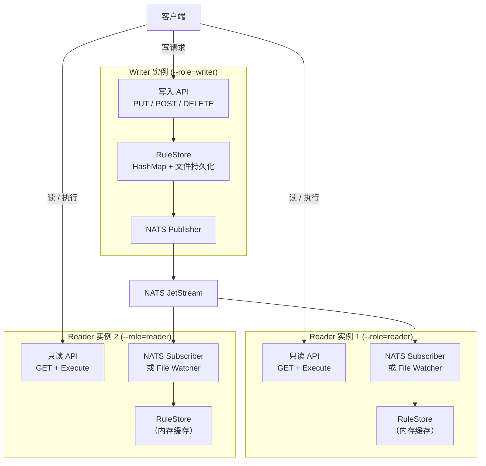
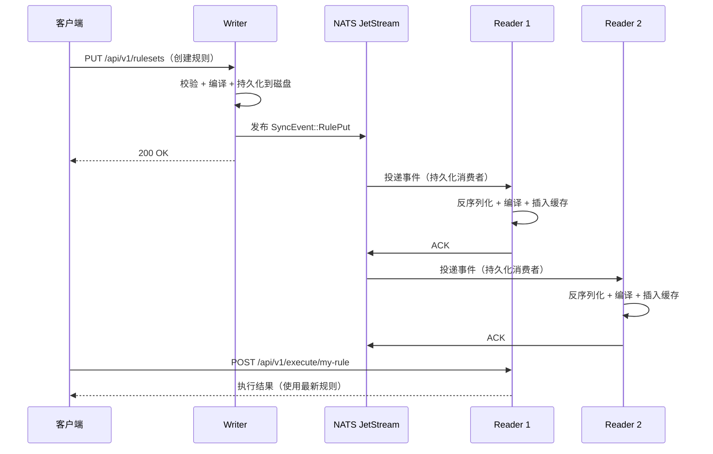
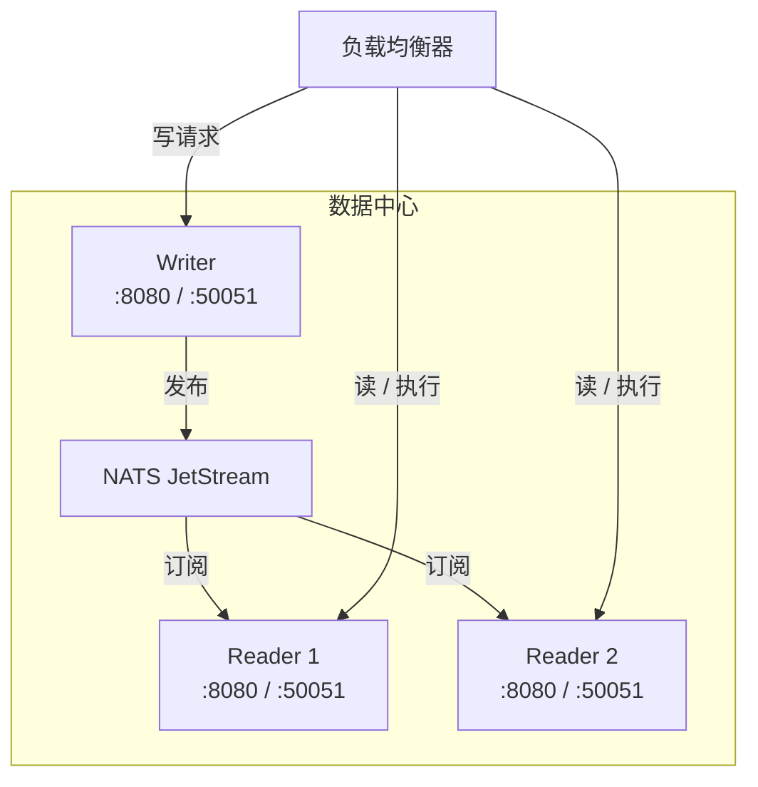

# 分布式部署

Ordo 支持**单写多读**的分布式部署模型。一个 Writer 实例负责所有规则变更，多个 Reader 实例提供只读和执行服务。规则变更通过文件监控（同机部署）或 NATS JetStream（跨机部署）自动传播。

## 架构总览



## 设计原则

| 原则               | 说明                                                                             |
| ------------------ | -------------------------------------------------------------------------------- |
| **单写多读**       | 一个 Writer 实例处理变更；Reader 拒绝写入并返回 `409 Conflict`，附带 Writer 地址 |
| **零执行路径影响** | 同步仅在管理面（规则 CRUD）生效，`Arc<RuleSet>` 的执行路径保持不变               |
| **优雅降级**       | 同步通道断开时，所有实例继续用本地缓存提供服务，只是无法接收新规则               |
| **向后兼容**       | 不加同步参数时行为与当前完全一致                                                 |

## 实例角色

通过 `--role` 参数配置实例角色：

### Standalone（默认）

当前的单节点模式，完全读写，无同步。

```bash
ordo-server --rules-dir ./rules
```

### Writer

接受所有变更操作（PUT/POST/DELETE），并将变更发布给 Reader。

```bash
ordo-server --role writer --rules-dir ./rules --nats-url nats://localhost:4222
```

### Reader

**只读模式** — 提供 GET 和 execute 服务，拒绝所有写操作：

- **HTTP**：返回 `409 Conflict`，Body 为 `{"error": "read_only", "writer": "http://..."}`
- **gRPC**：返回 `FAILED_PRECONDITION` 状态

```bash
ordo-server --role reader --nats-url nats://localhost:4222 --writer-addr http://writer:8080
```

## 同步机制

Ordo 提供两种同步机制，可以独立使用或组合使用：

### 1. 文件监控（Phase 1 — 同机部署）

适用于 Writer 和 Reader 共享文件系统的场景（同机或 NFS 挂载）：

```bash
# Writer
ordo-server --role writer --rules-dir /shared/rules --watch-rules

# Reader（同机或 NFS 挂载）
ordo-server --role reader --rules-dir /shared/rules --watch-rules \
  --writer-addr http://localhost:8080
```

**工作原理：**

1. Writer 将规则变更持久化到 `--rules-dir`
2. Reader 的文件监控检测到变更（200ms 防抖窗口）
3. Reader 热加载修改后的规则到内存
4. 自身写入抑制：Writer 不会重复加载自己刚写入的文件

**降级策略：** 如果原生文件监控启动失败，自动切换到 30 秒全量扫描轮询。

### 2. NATS JetStream（Phase 2 — 跨机部署）

适用于多机部署，使用 [NATS](https://nats.io) 作为事件传输通道：

```bash
# Writer（机器 1）
ordo-server --role writer --rules-dir /data/rules \
  --nats-url nats://nats:4222

# Reader（机器 2）
ordo-server --role reader \
  --nats-url nats://nats:4222 \
  --writer-addr http://writer:8080

# Reader（机器 3）— 也可配置本地 rules-dir 作为缓存
ordo-server --role reader --rules-dir /data/rules \
  --nats-url nats://nats:4222 --watch-rules \
  --writer-addr http://writer:8080
```

**工作原理：**

1. Writer 在每次变更成功后，将 `SyncEvent` 发布到 NATS JetStream
2. 每个 Reader 拥有一个**持久化拉取消费者**（durable pull consumer）— 重启后从上次确认的位置继续消费
3. 回声抑制：每个实例有唯一的 `--instance-id`，跳过来自自身的消息
4. 幂等去重：Reader 比较事件版本号与本地规则版本，仅应用更新的



::: tip 组合使用两种机制
可以同时启用文件监控和 NATS 同步以实现冗余。NATS 提供快速实时传播，文件监控作为最终一致性的后备方案。
:::

## 配置参考

### 角色与同步

| 参数            | 环境变量           | 默认值       | 说明                                         |
| --------------- | ------------------ | ------------ | -------------------------------------------- |
| `--role`        | `ORDO_ROLE`        | `standalone` | 实例角色：`standalone`、`writer` 或 `reader` |
| `--writer-addr` | `ORDO_WRITER_ADDR` | —            | Writer 地址，包含在 Reader 的 409 响应中     |
| `--watch-rules` | `ORDO_WATCH_RULES` | `false`      | 启用文件系统监控实现实时规则热加载           |

### NATS 同步

| 参数                    | 环境变量                   | 默认值       | 说明                                          |
| ----------------------- | -------------------------- | ------------ | --------------------------------------------- |
| `--nats-url`            | `ORDO_NATS_URL`            | —            | NATS 服务器地址（如 `nats://localhost:4222`） |
| `--nats-subject-prefix` | `ORDO_NATS_SUBJECT_PREFIX` | `ordo.rules` | 同步事件的 Subject 前缀                       |
| `--instance-id`         | `ORDO_INSTANCE_ID`         | 随机生成     | 唯一实例 ID，用于消费者命名和回声抑制         |

::: warning 需要 Feature Flag
NATS 同步需要在编译时启用 `nats-sync` 特性：

```bash
cargo build --release --features nats-sync
```

不启用此特性时，`--nats-url` 参数可以接受但不会生效。
:::

## 部署拓扑

### 拓扑 1：同机多端口

最简部署方式，使用文件监控同步。

```bash
# Writer 监听 8080
ordo-server --role writer -p 8080 --rules-dir ./rules --watch-rules

# Reader 监听 8081
ordo-server --role reader -p 8081 --grpc-port 50052 \
  --rules-dir ./rules --watch-rules \
  --writer-addr http://localhost:8080
```


### 拓扑 2：多机 NATS 部署

生产级部署，需要一个 NATS 服务器（或集群）。

```bash
# 机器 1：Writer
ordo-server --role writer --rules-dir /data/rules \
  --nats-url nats://nats:4222 --instance-id writer-1

# 机器 2：Reader
ordo-server --role reader \
  --nats-url nats://nats:4222 --instance-id reader-1 \
  --writer-addr http://writer:8080

# 机器 3：Reader
ordo-server --role reader \
  --nats-url nats://nats:4222 --instance-id reader-2 \
  --writer-addr http://writer:8080
```



### 拓扑 3：Kubernetes 部署

使用环境变量配合 NATS Helm Chart：

```yaml
# Writer Deployment
apiVersion: apps/v1
kind: Deployment
metadata:
  name: ordo-writer
spec:
  replicas: 1 # 必须为 1
  template:
    spec:
      containers:
        - name: ordo
          image: ordo-server:latest
          args: ['--features', 'nats-sync']
          env:
            - name: ORDO_ROLE
              value: 'writer'
            - name: ORDO_RULES_DIR
              value: '/data/rules'
            - name: ORDO_NATS_URL
              value: 'nats://nats:4222'
            - name: ORDO_INSTANCE_ID
              valueFrom:
                fieldRef:
                  fieldPath: metadata.name
          volumeMounts:
            - name: rules
              mountPath: /data/rules
      volumes:
        - name: rules
          persistentVolumeClaim:
            claimName: ordo-rules-pvc
---
# Reader Deployment
apiVersion: apps/v1
kind: Deployment
metadata:
  name: ordo-reader
spec:
  replicas: 3 # 按需扩缩
  template:
    spec:
      containers:
        - name: ordo
          image: ordo-server:latest
          env:
            - name: ORDO_ROLE
              value: 'reader'
            - name: ORDO_NATS_URL
              value: 'nats://nats:4222'
            - name: ORDO_WRITER_ADDR
              value: 'http://ordo-writer:8080'
            - name: ORDO_INSTANCE_ID
              valueFrom:
                fieldRef:
                  fieldPath: metadata.name
```

## 同步事件

以下事件会被发布到 NATS JetStream：

| 事件                  | 触发时机       | Subject 格式                  |
| --------------------- | -------------- | ----------------------------- |
| `RulePut`             | 规则创建或更新 | `{prefix}.{tenant_id}.{name}` |
| `RuleDeleted`         | 规则删除       | `{prefix}.{tenant_id}.{name}` |
| `TenantConfigChanged` | 租户配置变更   | `{prefix}.tenants`            |

**JetStream Stream 名称**：`ordo-rules`
**消息保留时间**：7 天（Limits 保留策略）
**消费者**：持久化拉取消费者，命名为 `ordo-{instance-id}`

### 事件信封

每条消息包含一个信封，携带回声抑制的元数据：

```json
{
  "instance_id": "writer-1",
  "event": {
    "type": "RulePut",
    "tenant_id": "default",
    "name": "payment-check",
    "ruleset_json": "{...}",
    "version": "2.0.0"
  },
  "timestamp_ms": 1709000000000
}
```

## 多租户支持

在多租户部署中，同步事件包含租户 ID，各租户的规则相互隔离：

```bash
# 启用多租户的 Writer
ordo-server --role writer --rules-dir /data/rules \
  --multi-tenancy-enabled --nats-url nats://nats:4222

# 启用多租户的 Reader
ordo-server --role reader --multi-tenancy-enabled \
  --nats-url nats://nats:4222
```

NATS Subject 遵循 `ordo.rules.{tenant_id}.{rule_name}` 格式，支持按租户过滤。

## 优雅降级

Ordo 优先保证可用性而非严格一致性：

| 场景                      | 行为                                                                        |
| ------------------------- | --------------------------------------------------------------------------- |
| NATS 连接断开             | Writer 继续提供写服务（事件缓冲在 channel 中）。Reader 使用本地缓存继续服务 |
| NATS 重连                 | `async-nats` 自动重连；持久化消费者从上次确认位置重放                       |
| 文件监控失败              | 自动回退到 30 秒轮询                                                        |
| Reader 在 Writer 之前启动 | Reader 以空缓存提供服务，直到收到第一个同步事件                             |

## 验证同步

### 检查实例角色

```bash
# 健康检查会显示实例角色
curl http://localhost:8080/health
```

### 测试 Reader 写入拒绝

```bash
# 在 Reader 实例上尝试创建规则
curl -X POST http://reader:8080/api/v1/rulesets \
  -H "Content-Type: application/json" \
  -d '{"config":{"name":"test"}}'

# 响应：409 Conflict
# {"error":"read_only","message":"...","writer":"http://writer:8080"}
```

### 验证规则传播

```bash
# 在 Writer 上创建规则
curl -X POST http://writer:8080/api/v1/rulesets \
  -H "Content-Type: application/json" \
  -d @rule.json

# 检查是否出现在 Reader 上（约 1 秒内）
curl http://reader:8080/api/v1/rulesets/my-rule
```

## 编译 NATS 支持

NATS 同步通过 Feature Flag 控制，保持默认二进制文件精简：

```bash
# 编译带 NATS 支持的版本
cargo build --release --features nats-sync

# 不带 NATS 编译（默认 — 文件监控仍可用）
cargo build --release
```

## 启动 NATS 服务器

如果还没有 NATS 服务器，启用 JetStream 模式启动一个：

```bash
# Docker
docker run -d --name nats -p 4222:4222 nats:latest -js

# 二进制
nats-server -js
```

详细的集群部署请参考 [NATS 官方文档](https://docs.nats.io/running-a-nats-service/introduction/installation)。
